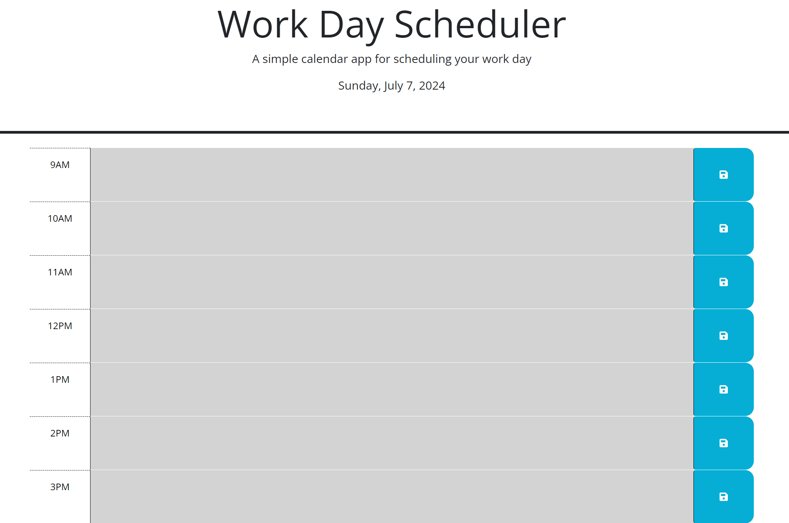

## Work Day Scheduler

## Description
The Work Day Scheduler is a simple calendar application that allows users to save events for each hour of the workday. This app features dynamically updated HTML and CSS powered by jQuery and Day.js. Users can input tasks or events for each hour, save them, and have their inputs persist through local storage.

## Features
- Displays the current date at the top of the page.
- Time blocks for standard business hours (9AM to 5PM).
- Each time block is color-coded to indicate whether it is in the past, present, or future.
- Users can enter and save tasks or events for each hour.
- Saved tasks persist after refreshing the page.

## Link to Deployed Site
https://tylerz3936.github.io/M5-work-day-scheduler/

Screenshot
 

## Usage
1. Open the Work Day Scheduler application.
2. The current date is displayed at the top of the page.
3. Scroll down to see the time blocks for each hour of the workday.
4. Click on a time block and enter your task or event.
5. Click the save button on the right side of the time block to save your input.
6. The saved tasks will persist even after refreshing the page.

## Technologies Used
- HTML
- CSS
- JavaScript
- jQuery
- Day.js
- Bootstrap
- FontAwesome